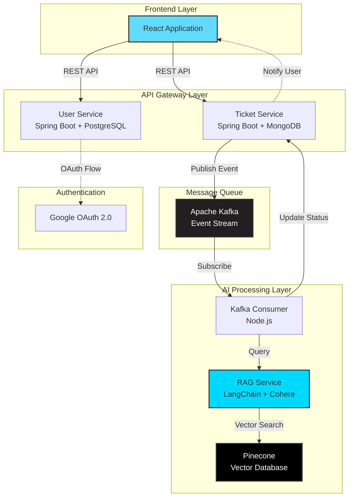
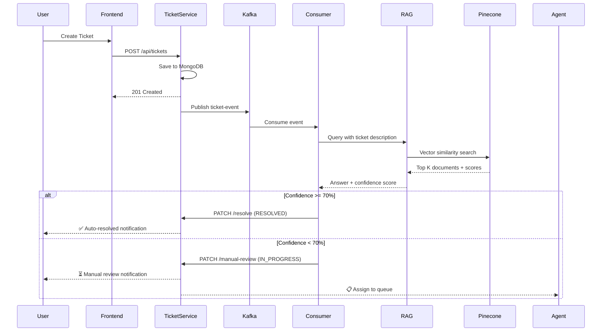

# Intellidesk

[](https://opensource.org/licenses/MIT)
[](https://spring.io/projects/spring-boot)
[](https://nodejs.org/)
[](https://reactjs.org/)

> An intelligent ticket management system that automatically resolves common issues using RAG (Retrieval-Augmented Generation) and vector search technology.

## 🎯 Overview

Intellidesk is an AI-powered helpdesk platform that combines traditional ticket management with cutting-edge RAG technology. It automatically analyzes incoming tickets, searches through your knowledge base using vector similarity, and provides instant resolutions for common issues. Tickets that require human expertise are seamlessly routed to support agents.

### Key Features

- **🤖 AI-Powered Auto-Resolution**: Automatically resolves tickets using RAG with confidence scoring
- **📊 Intelligent Ticket Management**: Complete CRUD operations with priority and status tracking
- **🔍 Vector Search**: Leverages Pinecone for semantic search across knowledge base
- **⚡ Real-Time Processing**: Event-driven architecture using Apache Kafka
- **📈 Confidence Scoring**: Only auto-resolves tickets above 70% confidence threshold
- **👥 Manual Review Queue**: Low-confidence tickets routed to human agents
- **📚 Knowledge Base**: Easily expandable document repository

## 🏗️ Architecture

### System Architecture



### Ticket Resolution Flow



## 🛠️ Technology Stack

### Backend Services

| Service | Technology | Purpose |
|---------|-----------|---------|
| **User Service** | Spring Boot 3.x, PostgreSQL | User authentication, OAuth2.0, user management |
| **Ticket Service** | Spring Boot 3.x, MongoDB | Ticket CRUD, status management, assignment |
| **RAG Service** | Node.js, LangChain, Cohere | Vector search, answer generation, confidence scoring |
| **Kafka Consumer** | Node.js, KafkaJS | Event processing, RAG orchestration |

### Infrastructure

- **Message Queue**: Apache Kafka
- **Vector Database**: Pinecone
- **Databases**: PostgreSQL (users), MongoDB (tickets)
- **Authentication**: Google OAuth 2.0

### Frontend

- **Framework**: React 18.x
- **State Management**: React Hooks
- **HTTP Client**: Axios/Fetch
- **Styling**: Tailwind CSS

## 📋 Prerequisites

- **Java 17+** (for Spring Boot services)
- **Node.js 18+** (for RAG service and consumer)
- **PostgreSQL 14+** (for user service)
- **MongoDB 6+** (for ticket service)
- **Apache Kafka 3.x** (message broker)
- **Docker & Docker Compose** (optional, for containerization)

### API Keys Required

- **Google OAuth 2.0** credentials (Client ID & Secret)
- **Pinecone** API key
- **Cohere** API key

## 🚀 Getting Started

### 1. Clone the Repository

```bash
git clone https://github.com/himanshugoyal77/Intellidesk.git
cd Intellidesk
```

### 2. Set Up Databases

**PostgreSQL (User Service)**
```sql
CREATE DATABASE intellidesk_users;
```

**MongoDB (Ticket Service)**
```bash
mongosh
use intellidesk_tickets
```

### 3. Start Kafka

```bash
# Using Docker
docker-compose up -d kafka zookeeper

# Or download from https://kafka.apache.org/downloads
bin/kafka-server-start.sh config/server.properties
```

### 4. Configure Services

#### User Service (`user-service/src/main/resources/application.yml`)

```yaml
spring:
  datasource:
    url: jdbc:postgresql://localhost:5432/intellidesk_users
    username: your_username
    password: your_password
  
```

#### Ticket Service (`ticket-service/src/main/resources/application.yml`)

```yaml
spring:
  data:
    mongodb:
      uri: mongodb://localhost:27017/intellidesk_tickets
  
  kafka:
    bootstrap-servers: localhost:9092
    producer:
      value-serializer: org.springframework.kafka.support.serializer.JsonSerializer

ticket:
  kafka:
    topic: ticket-events
```

#### RAG Service (`.env`)

```env
# Pinecone Configuration
PINECONE_API_KEY=your_pinecone_api_key
PINECONE_INDEX_NAME=intellidesk-kb
PINECONE_ENVIRONMENT=your_environment

# Cohere Configuration
COHERE_API_KEY=your_cohere_api_key

# Server Configuration
PORT=3000
```

#### Kafka Consumer (`.env`)

```env
# Kafka Configuration
KAFKA_BROKERS=localhost:9092
KAFKA_CLIENT_ID=intellidesk-consumer
KAFKA_GROUP_ID=ticket-rag-group
KAFKA_TOPIC=ticket-events

# Service URLs
RAG_API_URL=http://localhost:3000/api/query
SPRING_BOOT_API_URL=http://localhost:8081/api/tickets

# RAG Settings
CONFIDENCE_THRESHOLD=0.70
PINECONE_NAMESPACE=tickets
TOP_K_DOCUMENTS=5
```

### 5. Install Dependencies & Run Services

#### User Service
```bash
cd user-service
./mvnw clean install
./mvnw spring-boot:run
# Runs on http://localhost:8080
```

#### Ticket Service
```bash
cd ticket-service
./mvnw clean install
./mvnw spring-boot:run
# Runs on http://localhost:8081
```

#### RAG Service
```bash
cd rag-service
npm install
npm start
# Runs on http://localhost:3000
```

#### Kafka Consumer
```bash
cd kafka-consumer
npm install
npm start
```

#### Frontend
```bash
cd frontend
npm install
npm run dev
# Runs on http://localhost:5173
```

## 📚 API Documentation

### User Service (Port 8080)


#### User Management
```http
GET /api/users/me
# Get current user profile

PUT /api/users/profile
# Update user profile
```

### Ticket Service (Port 8081)

#### Ticket Operations
```http
POST /api/tickets
Content-Type: application/json

{
  "title": "Login issue",
  "description": "Cannot login to my account",
  "priority": "HIGH",
  "category": "authentication"
}

GET /api/tickets
# List all tickets (with pagination)

GET /api/tickets/{id}
# Get ticket by ID

PATCH /api/tickets/{id}
# Update ticket

DELETE /api/tickets/{id}
# Delete ticket
```

#### Internal Endpoints (Called by Kafka Consumer)
```http
PATCH /api/tickets/{id}/resolve
# Mark ticket as resolved with RAG answer

PATCH /api/tickets/{id}/manual-review
# Mark ticket for manual review
```

### RAG Service (Port 3000)

```http
POST /api/query
Content-Type: application/json

{
  "question": "How do I reset my password?",
  "namespace": "tickets",
  "k": 5
}

Response:
{
  "success": true,
  "question": "How do I reset my password?",
  "answer": "To reset your password, click on 'Forgot Password'...",
  "overallConfidence": 87.5,
  "documents": [...]
}
```

## 🎯 How It Works

### Ticket Lifecycle

1. **Creation**: User submits a ticket through the frontend
2. **Storage**: Ticket saved to MongoDB with status `OPEN`
3. **Event Publishing**: Ticket details published to Kafka topic
4. **RAG Processing**: 
   - Kafka consumer receives the event
   - Queries RAG service with ticket description
   - RAG performs vector similarity search in Pinecone
   - Returns answer with confidence score
5. **Decision Making**:
   - **High Confidence (≥70%)**: Ticket auto-resolved, user notified
   - **Low Confidence (<70%)**: Routed to manual review queue
6. **Resolution**: Agent reviews and resolves manually if needed

### Confidence Scoring

The system uses cosine similarity scores from Pinecone, normalized to 0-100%:

- **90-100%**: Excellent match, highly confident
- **70-89%**: Good match, auto-resolve threshold
- **50-69%**: Moderate match, requires human review
- **Below 50%**: Poor match, manual handling required


## 🤝 Contributing

1. Fork the repository
2. Create your feature branch (`git checkout -b feature/amazing-feature`)
3. Commit your changes (`git commit -m 'Add amazing feature'`)
4. Push to the branch (`git push origin feature/amazing-feature`)
5. Open a Pull Request
